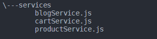

# module pattern

Uygulamamız ve code base büyüdükçe, kodumuzu sürdürülebilir tutmak giderek zorlaşıyor. Module pattern, kodumuzu daha küçük, yeniden kullanılabilir parçalara ayırmamızı sağlayarak sürdürülebilirlik durumuna çözüm sunuyor.

Bir örnek ile module pattern tam olarak anlamaya çalışalım.

<figure><figcaption><p>tree /f /a</p></figcaption></figure>

3 adet servisimiz olduğunu düşünelim ve bu servisler içerisinde çeşitli aksiyonlar alıyoruz. Şimdi bu aksiyonları basit bir şekilde simüle edelim.&#x20;

<pre class="language-javascript"><code class="lang-javascript">//blogService.js
import slugify from "slugify";

<strong>function create(...args) {
</strong>  db.create({
    author: args.author.charAt(0).toUpperCase() + args.author.slice(1),
    title: args.title.charAt(0).toUpperCase() + args.title.slice(1),
    slug: slugify(args.slug, { lower: true }),
  });
}</code></pre>

```javascript
//productService.js
import slugify from "slugify";

function numberFormat(n, x, s = ".", c = ",") {
  var re = "\\d(?=(\\d{" + (x || 3) + "})+" + (n > 0 ? "\\D" : "$") + ")",
    num = this.toFixed(Math.max(0, ~~n));
  return (c ? num.replace(".", c) : num).replace(
    new RegExp(re, "g"),
    "$&" + (s || ",")
  );
}

function create(...args) {
  db.create({
    name: args.name,
    price: numberFormat(args.price, 2),
    slug: slugify(args.slug, { lower: true }),
  });
}

```

```javascript
//cartService.js
import slugify from "slugify";

function numberFormat(n, x, s = ".", c = ",") {
  var re = "\\d(?=(\\d{" + (x || 3) + "})+" + (n > 0 ? "\\D" : "$") + ")",
    num = this.toFixed(Math.max(0, ~~n));
  return (c ? num.replace(".", c) : num).replace(
    new RegExp(re, "g"),
    "$&" + (s || ",")
  );
}

function create(...args) {
  db.create({
    product: args.product,
    totalAmount: numberFormat(args.totalAmount, 2),
  });
}

```

Tüm servislerimiz içerisine bir create fonksiyonu tanımadık ve gelen argümanlarımıza göre db.create işlemlerini çalıştırdık. db.create işlemine verilerimiz gönderirken çeşitli formatlama işlemlerinden geçirdik. Kodları incelediğimizde blogService ve productService içerisinde slugify paketi import edilmiş. blogService içerisinde ilk karakteri büyütmek için iki ayrı argümana capitalize işlemi yapılmış. productService ve cartService içerisinde ise numberFormat fonksiyonu oluşturularak price ve totalAmount değerleri formatlanmış.&#x20;

Görüldüğü üzere aynı işlemleri farklı servislerde kullandık ve her servisin kendi özelinde bunları tanımlamak zorunda kaldık. Bu durumdan kurtulmak kod tekrarını önlemek ve sürdürülebilir bir code base oluşturmak için tekrar eden işlemlerimizi bir modül altında toplayalım.

Tüm formatlama vb işlemlerimizi helper.js adında bir dosya oluşturup içerisine yazıyoruz. export anahtar kelimesi ile fonksiyonlarımızı dışa aktarmış oluyoruz. Böylece helper modülü import edilerek bu fonksiyonlar kullanılabilir olacaktır.

```javascript
import slugify from "slugify";

export function numberFormat(n, x, s = ".", c = ",") {
  var re = "\\d(?=(\\d{" + (x || 3) + "})+" + (n > 0 ? "\\D" : "$") + ")",
    num = this.toFixed(Math.max(0, ~~n));
  return (c ? num.replace(".", c) : num).replace(
    new RegExp(re, "g"),
    "$&" + (s || ",")
  );
}

export function makeSlug(value, options = { lower: true }) {
  return slugify(value, options);
}

export function capitalizeFirstLetter(string) {
  return string.charAt(0).toUpperCase() + string.slice(1);
}
```

Şimdi bu modülü servislerimiz içerisinde kullanalım ve kodlarımızı tekrar inceleyelim.

```javascript
//blogService.jse
import {capitalizeFirstLetter, makeSlug} from "helper"

function create(...args) {
  db.create({
    author: capitalizeFirstLetter(args.author),
    title: capitalizeFirstLetter(args.title),
    slug: makeSlug(args.slug),
  });
}
```

```javascript
//productService.js
import {numberFormat, makeSlug} from "helper"

function create(...args) {
  db.create({
    name: args.name,
    price: numberFormat(args.price, 2),
    slug: makeSlug(args.slug),
  });
}

```

```javascript
//cartService.js
import {numberFormat} from "helper"

function create(...args) {
  db.create({
    product: args.product,
    totalAmount: numberFormat(args.totalAmount, 2),
  });
}

```

Servislerimiz içerisinde tekrar eden kodları ortadan kaldırmış olduk. Böylece daha okunaklı kod yapımız ile güncellenebilirlik durumunu da arttırmış olduk.
