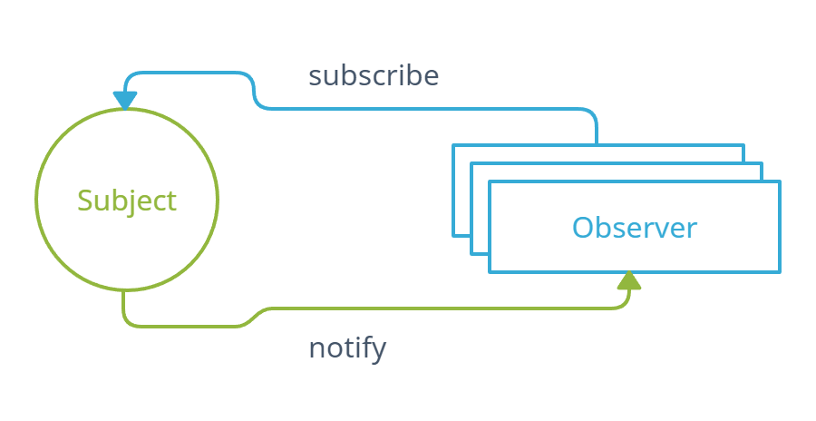
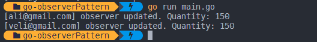

# observer pattern

### Observer Pattern Nedir?

Bir nesnenin davranışları hakkında, bilgi almak isteyen diğer nesnelere haber vermesini sağlayan tasarım modelidir.

Observer Pattern içerisinde iki önemli kavram vardır. Bunlar Subject ve Observer yapılarıdır. **Subject** gözlemlenen yani haber beklenen nesnedir. **Observer** ise gözlemlenen nesnemizden haber bekleyen tüm nesnelerdir.&#x20;

Subject ve Observer'lar arasında one to many (bire çok) ilişki vardır. Yani bir nesnenin birden çok gözlemcisi olabilir.&#x20;

<figure><figcaption></figcaption></figure>

### Observer Pattern Kullanımı

Bir örnek ile gözlemci modelini yakından inceleyelim. Observer Pattern mantığını uygulamak için e-ticaretten bir senaryo düşünebiliriz. Bir müşterinin satın almak istediği ürün o an stoklarda yok ise "Gelince Haber Ver" özelliğini kullanıp o ürünün stoklara girmesiyle birlikte otomatik bir bildirim alma senaryosunu go ile uygulayalım.

Go projemizi oluşturduktan sonra main.go içerisine Subject ve Observer yapılarımız için birer interface oluşturalım. &#x20;

```go
type Subject interface {
	AddObserver(o Observer)
	RemoveObserver(o Observer)
	Notify()
}

type Observer interface {
	Update(int)
}
```

Subject içerisinde bulunan fonksiyonları kısaca açıklayalım.&#x20;

**AddObserver** : Subject nesnemizi dinlemek isteyen gözlemcileri kaydetmemizi sağlayan fonksiyondur.

**RemoveObserver**: Subject nesnemizi dinleyen gözlemciler listemizden bir gözlemciyi silmemizi sağlayan fonksiyondur.&#x20;

**Notify**: Subject nesnemizi dinleyen tüm gözlemcilerimizin Update fonksiyonunu tetiklediğimiz fonksiyondur. Yani Subject kendini izleyen gözlemcileri değişiklikler konusunda haberdar eder.&#x20;

Observer içerisinde bulunan fonksiyonu da açıklayalım.&#x20;

**Update**: Subject nesnemizin notify işlemini gerçekleştirdiğinde tetiklenecek fonksiyondur. Bu şekilde gözlemciler değişikliklerden haberdar olmuş olur.&#x20;

Şimdi somut bir gözlemci için bir struct oluşturalım. Bu struct'ın Observer interface'ini uygulaması gerekmektedir. StockNotifyObserver yapımız içerisine quantity ve email özelliklerini tanımladık. email stok bildirimi göndereceğimiz müşterinin mail adresini, quantity ise gözlemlenen ürünün güncel stok sayısını tutacaktır. &#x20;

```go
type StockNotifyObserver struct {
	email    string
	quantity int
}

func (s *StockNotifyObserver) Update(quantity int) {
	s.quantity = quantity
	fmt.Printf("[%s] observer updated. Quantity: %d\n", s.email, quantity)
}
```

Observer interface'ini uygulayarak oluşturduğumuz Update fonksiyonu ise Subject'in bize göndereceği güncel stok sayısını alacaktır.&#x20;

Observer yapımızı tamamladık şimdi Subject interface'ini uygulayan somut bir struct oluşturalım. Bu yapı gözlemci ekleyecek veya kaldıracak ayrıca oluşan değişikliklerden tüm gözlemcileri haberdar edecektir.&#x20;

```go
type StockNotifyMonitor struct {
	quantity  int
	observers []Observer
}

func (s *StockNotifyMonitor) AddObserver(o Observer) (bool, error) {
	for _, observer := range s.observers {
		if observer == o {
			return false, errors.New("observer already exists")
		}
	}
	s.observers = append(s.observers, o)
	return true, nil
}

func (s *StockNotifyMonitor) RemoveObserver(o Observer) (bool, error) {
	for i, observer := range s.observers {
		if observer == o {
			s.observers = append(s.observers[:i], s.observers[i+1:]...)
			return true, nil
		}
	}
	return false, errors.New("observer not found")
}

func (s *StockNotifyMonitor) Notify() (bool, error) {
	for _, observer := range s.observers {
		observer.Update(s.quantity)
	}
	return true, nil
}

func (s *StockNotifyMonitor) SetQuantity(quantity int) {
	s.quantity = quantity
	s.Notify()
}
```

Oluşturduğumuz StockNotifyMonitor yapısı Subject interface'ini uygulayarak gerekli tüm işlemleri yerine getirecek şekilde düzenlenmiştir. Fonksiyonları üst kısımlarda kabaca açıklamıştık fakat şimdi biraz daha detaylandıralım.&#x20;

Yapımız içerisinde oluşturduğumuz observers dizisi tüm gözlemcileri içinde barındıracaktır. AddObserver fonksiyonu ile eklemek istediğimiz gözlemci, dizimiz içerisinde mevcut mu kontrolü yapıyoruz. Eğer mevcut değilse gözlemcimizi dizimiz içerisine ekliyoruz. RemoveObserver fonksiyonunda ise kaldırmak istediğimiz observer, dizimiz içerisinde mevcut mu kontrolü yapıp eğer mevcutsa dizimizi içerisinden kaldırıyoruz. Notify fonksiyonu ile dizimiz içerisindeki tüm observer'ları dolaşarak Update fonksiyonlarına güncel stok sayısını gönderiyoruz. Son olarak SetQuantity ile stok adetini güncelliyoruz ve stok sayısında bir değişiklik olduğu için Notfiy fonksiyonunu çağırıp tüm gözlemcileri güncel stoktan haberdar ediyoruz.&#x20;

Şimdi main fonksiyonumuz içerisinde yapımızı kullanarak çıktımızı görelim.&#x20;

```go
func main() {
	stockNotifyMonitor := &StockNotifyMonitor{quantity: 10}

	observerAli := &StockNotifyObserver{email: "ali@gmail.com"}
	observerVeli := &StockNotifyObserver{email: "veli@gmail.com"}

	stockNotifyMonitor.AddObserver(observerAli)
	stockNotifyMonitor.AddObserver(observerVeli)

	stockNotifyMonitor.SetQuantity(150)
}

```

Kodumuzu çalıştırdığımızda çıktımız aşağıdaki gibi olacaktır.&#x20;

<figure><figcaption></figcaption></figure>

### Sonuç

Observer pattern bir nesnede yaşanan değişiklikler doğrultusunda birden fazla nesneyi bu değişiklikten haberdar etmeyi sağlayan tasarım modelidir. Yukarıdaki örnek genel bir observer pattern örneğidir. Bu örnekten yola çıkarak OOP destekleyen programlama dillerinde de benzer örnekler yapabilirsiniz. Go'da observer pattern daha hızlı ve kolay uygulamak için go'nun bize sunduğu [channel](https://go.dev/tour/concurrency/2) yapısını da kullanabilirsiniz.&#x20;
