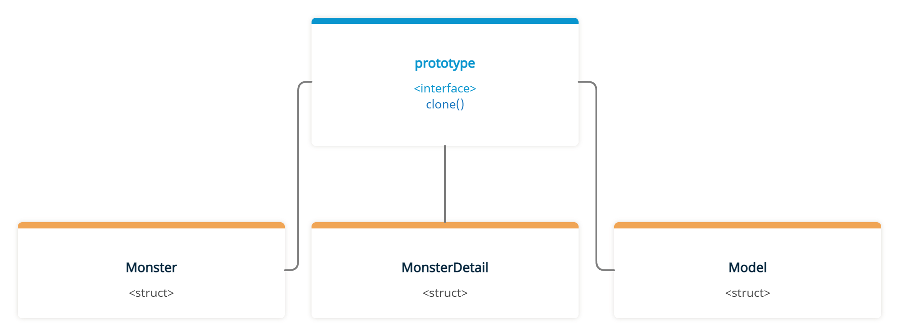
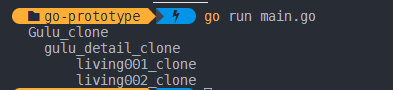

# prototype pattern

### Prototype Pattern Nedir?

Nesneleri klonlamamızı sağlayan creational design pattern'lardan bir tanesidir.&#x20;

### Prototype Pattern Nasıl Kullanılır?

Prototype pattern klon özelliği içeren bir arayüz sunar ve klonlama işlemini gerçekleştirecek nesnelere bu klon yapısı devredilir. Klonlama işlemi klonlanacak nesne içerisinde tanımlanır ve tüm sorumluluk bu nesneye aittir. Prototype pattern genelde karmaşık nesneleri kopyalamak için kullanılır. Sıfırdan bir nesneyi üretmek maliyetli olabileceği için var olan nesneyi kopyalayıp belirli düzenlemeler yapmak yükü azaltacaktır.&#x20;

Örnek olarak şöyle bir senaryo düşünebiliriz. Bir oyunumuz var ve bu oyunda sürekli etrafımızda aynı özelliklerde canavarlar spawn oluyor. Her bir canavar spawn olduğunda yeni bir canavar nesnesi üretmek yerine oyun başında oluşturacağımız canavar nesnesini kopyalayıp üzerinde bir kaç düzenleme yaparak kullanmak daha mantıklı olacaktır. Şimdi bu senaryoyu koda dökelim.

<figure><figcaption></figcaption></figure>

Öncelikle prototype arayüzünü oluşturalım. (Arayüz içerisinde bulunan show fonksiyonunu sadece print işlemi için kullanacağız.)

```go
type prototype interface {
	clone() prototype
	show(string)
}
```

Şimdi monster yapımızı oluşturalım.&#x20;

<pre class="language-go"><code class="lang-go">//Parent
type Monster struct {
	name   string
	detail prototype
}

//Parent > Child
<strong>type MonsterDetail struct {
</strong>	key     string
	blood   int
	damage  int
	guard   int
	attack  int
	defence int
	speed   int
	models  []prototype
}

//Parent > Child > Childs
type Model struct {
	name   string
	path   string
	script string
}</code></pre>

Daha sonra prototype arayüzü içerisinde bulunan zorunluklarımızı yapılarımıza tanımayalım. Bu tanımlama işlemlerini en alttan en üste olacak şekilde yapacağız.&#x20;

#### 1 - Model

```go
func (m *Model) clone() prototype {
	clone := m
	clone.name = m.name + "_clone"
	return clone
}

func (m *Model) show(parent string) {
	fmt.Println(parent + m.name)
}
```

#### 2 - MonsterDetail

```go
func (m *MonsterDetail) clone() prototype {
	clone := m
	//yeni bir canavar oluştuğunda güncellenmesi gereken özellikler
	clone.key = m.key + "_clone"
	clone.blood = 100
	clone.speed = rand.Intn(5)
	var models []prototype
	for _, i := range m.models {
		copy := i.clone()
		models = append(models, copy)
	}
	clone.models = models
	return clone
}

func (m *MonsterDetail) show(parent string) {
	fmt.Println(parent + m.key)
	for _, i := range m.models {
		i.show(parent + parent)
	}
}
```

#### 3 - Monster

```go
func (m *Monster) clone() prototype {
	clone := m
	clone.name = m.name + "_clone"
	clone.detail = m.detail.clone()
	return clone
}
func (m *Monster) show(parent string) {
	fmt.Println(parent + m.name)
	m.detail.show(parent + parent)
}	
```

Tüm yapılarımız için klonlama özelliklerini tanımladık. Şimdi main fonksiyonumuz içerisinde bir Monster oluşturup klonlama işlemini gerçekleştirelim.&#x20;

```go
func main() {

	model1 := &Model{
		name:   "living001",
		path:   "image/game/living/Living001",
		script: "GameServerScript.AI.NPC.TrainingNpc",
	}

	model2 := &Model{
		name:   "living002",
		path:   "image/game/living/Living002",
		script: "GameServerScript.AI.NPC.SimpleNpcAi",
	}

	monsterDetail := &MonsterDetail{
		key:     "gulu_detail",
		blood:   100,
		damage:  10,
		guard:   5,
		attack:  100,
		defence: 25,
		speed:   rand.Intn(5),
		models:  []prototype{model1, model2},
	}

	monster := &Monster{
		name:   "Gulu",
		detail: monsterDetail,
	}

	monster.clone()
	monster.show("  ")
}
```

Kodumuzu çalıştırdığımızda çıktımız aşağıdaki gibi olacaktır.

<figure><figcaption></figcaption></figure>

Bu şekilde Monster ve onun içerisinde olan tüm klonlanabilir yapıları klonladık. Ayrıca MonsterDetail'e ait clone fonksiyonu içerisinde canavarımızın başlangıçta güncellenmesi gereken değerlerini güncelledik. Böylece elimizde bulunan monster nesnesini klonlayıp sadece belirli alanları güncelleyerek süreçten tasarruf etmiş olduk. Tabii ki yaptığımız örnek sadece prototype pattern mantığını anlatmaktı. Farklı senaryolarda farklı şekillerde klonlama işlemi yapılabilir. &#x20;
