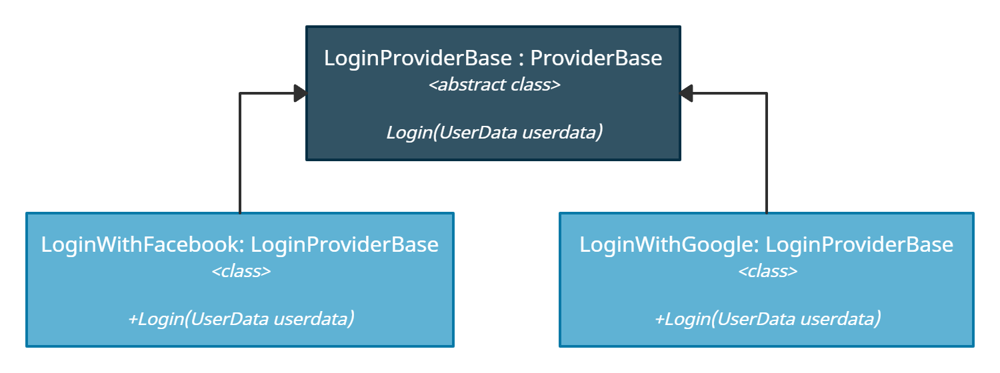

# provider pattern

Provider pattern microsoft tarafından .NET 2.0 sürümü ile duyurulmuş bir tasarım modelidir. Bu tasarım modeli üçüncü parti api'lar ile çalışırken veya veri depolarına erişim yaparken birden fazla seçenek arasında seçim yapmamızı sağlayarak kodumuzun güncellenebilir ve okunaklı olmasına olanak sağlar.

Kısa bir örnekle ile provider pattern kullanımına göz atalım.&#x20;

<figure><figcaption></figcaption></figure>

Soyut bir class oluşturalım ve tüm login metodlarımız içerisinde olacak ortak öğeleri bu class içerisinde tanımlayalım.

```csharp
public abstract class LoginProviderBase
{
     public abstract void Login(UserData userdata);
}
```

Daha sonra login metodlarımızı bu soyut class üzerinden üretelim.&#x20;

<pre class="language-csharp"><code class="lang-csharp">public class LoginWithFacebook : LoginProviderBase
{
<strong>    public override void Login(UserData userdata)
</strong>    {
<strong>    throw new NotImplementedException();
</strong>    }
}

public class LoginWithGoogle : LoginProviderBase
{
    public override void Login(UserData userdata)
    {
    throw new NotImplementedException();
<strong>    }
</strong>}</code></pre>

Bu şekilde ileride olacak güncellemeler ile yeni login metodlarını kolayca tanımlayabiliriz. Şimdi bu login metodlarından birini kullanalım.&#x20;

```csharp
var userData = new UserData() 
{
    Id = 1,
    Email = "test@gmail.com",
    Password = "**********",
};
string providerName = ConfigurationManager.AppSettings["loginType"];

LoginProviderBase provider = Activator.CreateInstance(Type.GetType(providerName)) as LoginProviderBase;
provider.Login(userData);
```

Configuration dosyamızda seçili olan login tipimize göre bir instance oluşturup login metodumuzu çalıştırmış olduk. Bu şekilde birden fazla login metodu tanımlayarak artık bir soyut sınıf üzerinden bunları kolayca yönetebilir ve güncelleyebiliriz.&#x20;
