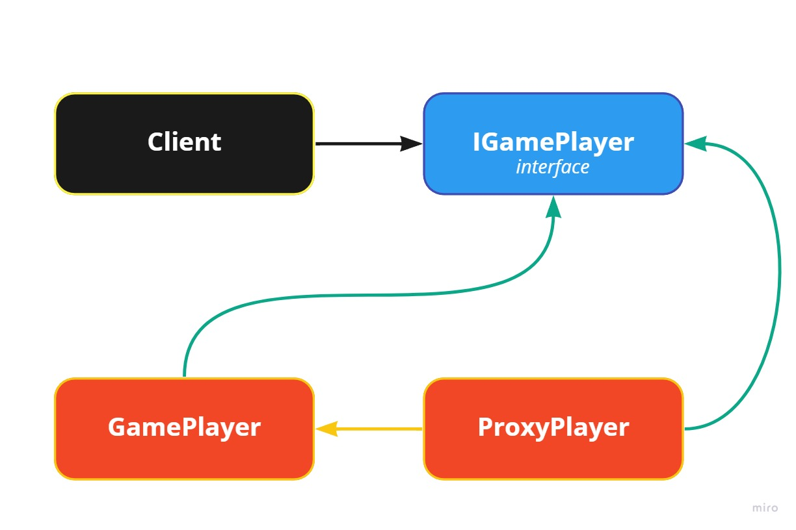

# proxy pattern

## Proxy Pattern Nedir?

Elimizde bulunan bir nesne ile etkileşime girerken daha fazla kontrole sahip olmak veya direkt olarak o nesneye erişmek yerine vekil bir nesne üzerinden işlemleri yürütmek için proxy modeli kullanılır. Proxy modeli ile var olan nesnemiz üzerinde çeşitli işlemler yaparken bir vekil **nesne** oluşturarak ana nesnemize erişimi bu vekil **nesne** üzerinden yapabiliriz. Bu şekilde ana nesnemize erişimde veya girilen diğer etkileşimlerde farklı aksiyonlar alarak nesnemizi daha yönetilebilir hale getirebiliriz.&#x20;

C#'da bir proxy modeli örneği yapalım.

```csharp
class Config {
    private string _appName;
    
    public string AppName {
        get {
        return _appName;
        }
        set {
        _appName = value;
        }
    }
}

Config conf = new Config();
Console.WriteLine(conf.AppName);

conf.AppName = "Proxy Pattern";
Console.WriteLine(conf.AppName);
```

Yukarıda bulunan yapımızda <mark style="color:orange;">**Config**</mark> adında bir sınıf oluşturduk ve içerisine private olarak <mark style="color:green;">**\_appName**</mark> değişkenini tanımladık. Daha sonra bu <mark style="color:green;">**\_appName**</mark> değişkenimize dışarıdan erişim sağlayabilmek adına public şekilde bir **AppName** property'si oluşturduk. Bu property proxy modelindeki proxy nesnesini temsil etmektedir.&#x20;

Sınıfımızın en alt kısmında config sınıfımızın bir nesnesini oluşturarak **AppName** property'mizi çağırdık. Bu property bize <mark style="color:green;">**\_appName**</mark> değişkenimize erişim sağlamak için bir aracı görevi görmektedir. En alt kısımda ise yine **AppName** property'sini kullanarak değişkenimizin değerini güncelledik. Bu kısma kadar normal bir değişkene yaptığımız işlemlerden farklı bir şey yapmadık. Fakat biz <mark style="color:green;">**\_appName**</mark> değişkenimize erişilmeye çalışırken veyahut değer güncellenmeye çalışırken farklı bir aksiyon almak isteseydik. İşte burada proxy modelinin mantığını kullanacağız.

Örneğin <mark style="color:green;">**\_appName**</mark> değişkenimize bir karakter sınırı koyalım. Belli bir karakter sınırı altında veri girişi olduğunda hata döndürelim.&#x20;

```csharp
class Config {
    private string _appName;
    
    public string AppName {
        get {
        return _appName;
        }
        set {
        if(value.Length < 5) throw new Exception("minimum number of characters is 5");
        _appName = value;
        }
    }
}

Config conf = new Config();
Console.WriteLine(conf.AppName);

conf.AppName = "Proxy Pattern";
Console.WriteLine(conf.AppName);

conf.AppName = "Prox";
```

Kodumuzu yukarıdaki gibi güncellediğimizde artık <mark style="color:green;">**\_appName**</mark> değişkenimizin alabileceği minimum karakter sayısını 5 olarak belirlemiş olduk. **set** işlemi gerçekleşmeden hemen önce gelen değerimizin karakter sayısını kontrol ederek eğer 5'den küçük ise <mark style="color:red;">**throw**</mark> ile hata mesajımızı gönderdik. Derleyicimiz **conf.AppName = "Prox"** kodumuzu çalıştırmayı denediğinde throw ile gönderdiğimiz hata ile karşılaşmış olacağız. Bu şekilde değişkenimizin getter ve setter işlemlerinden önce çeşitli aksiyonlar alabilir veya get ve set işlemlerinden herhangi birini kullanmak istemiyorsak bu bloğu kaldırarak değişkenimize sınırlama getirebiliriz.

Proxy modelini yukarıda bir sınıf içerisinde bulunan property ile örneklendirdik daha detaylı bir örnek ile yazıyı sonlandıralım.&#x20;

```csharp
    class PlayerInfo
    {
        string _username;
        int _grade;
        int _gp;

        public string Username
        {
            get { return _username; }
            set { username = value; }
        }
        
        public int Grade
        {
            get { return _grade; }
            set { _grade = value; }
        }
        
        public int Gp
        {
            get { return _gp; }
            set { _gp = value;}
        }
    }
    
    interface IGamePlayer
    {
        void loginPlayer(PlayerInfo playerInfo);
    }
    
    class ProxyPlayer : IGamePlayer
    {
        private GamePlayer _gamePlayer;
        string[] databaseUserList = { "melih", "demir", "bahri" };
       
        public ProxyPlayer(PlayerInfo playerInfo)
        {
            this._gamePlayer = new GamePlayer(playerInfo);
        }

        public void loginPlayer(PlayerInfo playerInfo)
        {
            if (!checkFromDatabase(playerInfo.Username))
            {
                throw new Exception("Invalid username");
            }
            this._gamePlayer.loginPlayer(playerInfo);
        }

        private bool checkFromDatabase(string username)
        {
            return Array.IndexOf(this.databaseUserList, username) != -1;
        }
    }

    class GamePlayer : IGamePlayer
    {

        private PlayerInfo _playerInfo;
        
        public PlayerInfo playerInfo
        {
            get
            {
                return _playerInfo;
            }
            set
            {
                this._playerInfo = value;
            }
        }

        public GamePlayer(PlayerInfo playerInfo)
        {
            this.playerInfo = playerInfo;
        }

        public void loginPlayer(PlayerInfo playerInfo)
        {
            this.playerInfo = playerInfo;
        }
    }


    PlayerInfo playerInfo = new PlayerInfo();
    playerInfo.Username = "bahri";
    playerInfo.Grade = 55;
    playerInfo.Gp = 212495955;

    IGamePlayer player = new ProxyPlayer(playerInfo);

    player.loginPlayer(playerInfo);
```

Bu örnekte **GamePlayer** sınıfımız üzerinde işlem yapmak için **ProxyPlayer** sınıfını oluşturduk. loginPlayer metodunu **ProxyPlayer** sınıfından bir nesne oluşturarak çağırdık ve kişinin kullanıcı adının veritabanı listemizde mevcut olup olmadığını kontrol ettik. Bu şekilde direkt olarak **GamePlayer** sınıfımız üzerinde bir işlem yapmadan verimizi kontrolden geçirmiş olduk ve bizim şartlarımız sağlandığı taktirde ana nesnemiz olan GamePlayer üzerinde işlem yapılmasına izin verdik.

<figure><figcaption></figcaption></figure>


