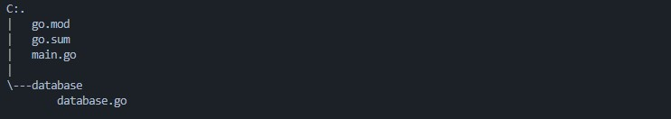
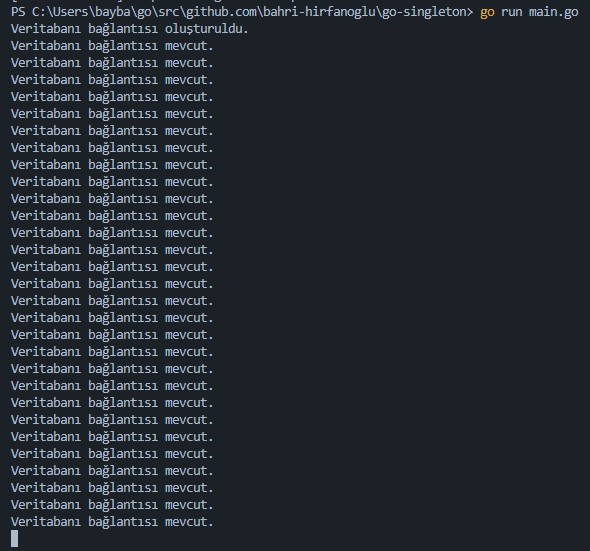

# Singleton Pattern

### Genel Tanım

Bir sınıfın sadece bir nesnesi olmasını sağlayan ve bu nesneye erişebileceğimiz ortak bir yapı oluşturan tasarım kalıbıdır.&#x20;

### Kullanılma Nedeni

Singleton pattern kullanılma amacı paylaşılan kaynaklara erişimi kontrol altına alarak teke indirmektir.&#x20;

### Kullanım Örneği



database/database.go

```go
package database

import (
	"database/sql"
	"fmt"
	"sync"

	_ "github.com/lib/pq"
)

var lock = &sync.Mutex{}

const (
	HOST     = "mydemoserver.postgres.database.azure.com"
	DATABASE = "testdb"
	USER     = "mylogin@mydemoserver"
	PASSWORD = "*****************"
)

var db *sql.DB

var connectionString string = fmt.Sprintf("host=%s user=%s password=%s dbname=%s sslmode=require", HOST, USER, PASSWORD, DATABASE)

func GetDbInstance() *sql.DB {
	if db == nil {
		lock.Lock()
		defer lock.Unlock()
		if db == nil {
			db, _ = sql.Open("postgres", connectionString)
			fmt.Println("Veritabanı bağlantısı oluşturuldu.")
		} else {
			fmt.Println("Veritabanı bağlantısı mevcut.")
		}
	} else {
		fmt.Println("Veritabanı bağlantısı mevcut.")
	}
	return db
}

```

main.go

```go
package main

import (
	"fmt"

	"github.com/bahri-hirfanoglu/go-singleton/database"
)

func main() {
	for i := 0; i < 30; i++ {
		go database.GetDbInstance()
	}
	fmt.Scanln()
}

```



database.go dosyamız içerisinde GetDbInstance fonksiyonunu kullanarak sql.Open işleminden dönen nesneyi her seferinde yeniden oluşturmak yerine sadece nesnenin bir örneği yoksa oluşturma işlemini yaparak aktif olan sql.DB nesnemizi teke sabitlemiş olduk.&#x20;
