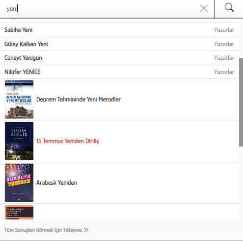

# multiple search

Elasticsearch ile tek query'de birden fazla index üzerinde search etmek için mutliple search (msearch) kullanılır. Elasticsearch REST ara birimi ile bir örnek yaparak kullanımına değinelim.&#x20;

Öncelikle msearch query yapısını inceleyelim. Sırayla 3 adet indeximiz için query yazalım. Daha sonra bunları birleştirelim. Bu şekilde durumu daha net anlayabiliriz.

### Products (index)

_Bu query'de is\_active alanı **1** olan ve **name** alanı <mark style="color:green;">**yeni**</mark> keyword'ü ile başlayan ürünleri listeleyecektir._

```json
{
    "query": {
        "bool": {
            "must": [
                {
                    "term": {
                        "tr.is_active": 1
                    }
                },
                {
                    "query_string": {
                        "query": "yeni*",
                        "fields": [
                            "tr.name"
                        ]
                    }
                }
            ]
        }
    }
}
```

<figure><figcaption></figcaption></figure>

### Categories (index)

_Bu query'de is\_active alanı **1** olan ve **title, description** alanları <mark style="color:green;">**yeni**</mark> keyword'ü ile başlayan kategorileri listeleyecektir._&#x20;

```json
{
    "query": {
        "bool": {
            "must": [
                {
                    "term": {
                        "tr.is_active": 1
                    }
                },
                {
                    "query_string": {
                        "query": "yeni*",
                        "fields": [
                            "tr.title",
                            "tr.description"
                        ]
                    }
                }
            ]
        }
    }
}
```

<figure><figcaption></figcaption></figure>

### Brands (index)

_Bu query'de is\_active alanı **1** olan ve **name, slug, type** alanları <mark style="color:green;">**yeni**</mark> keyword'ü ile başlayan markaları listeleyecektir._&#x20;

```json
{
    "query": {
        "bool": {
            "must": [
                {
                    "term": {
                        "tr.is_active": 1
                    }
                },
                {
                    "query_string": {
                        "query": "yeni*",
                        "fields": [
                            "tr.name",
                            "tr.slug",
                            "tr.type"
                        ]
                    }
                }
            ]
        }
    }
}
```

<figure><figcaption></figcaption></figure>

3 ayrı indeximiz için query'lerimizi oluşturduk şimdi bu query'leri birleştirip tek bir msearch query'si haline getirelim.

```json
 {"index":"products"},
 {"query": { "bool": { "must": [ { "term": { "tr.is_active": 1 } }, { "query_string": { "query": "fıstı*", "fields": [ "tr.name" ] } } ] } } }
 {"index":"categories"},
 {"query": { "bool": { "must": [ { "term": { "tr.is_active": 1 } }, { "query_string": { "query": "fıstı*", "fields": [ "tr.title", "tr.description" ] } } ] } } }
 {"index":"brands"},
 {"query": { "bool": { "must": [ { "term": { "tr.is_active": 1 } }, { "query_string": { "query": "fıstı*", "fields": [ "tr.name", "tr.slug", "tr.type" ] } } ] } } }
 
```

Yukarıda görüldüğü gibi her query'nin bir üst satırına hangi index'de çalıştırmak istiyorsak belirttik. Bu şekilde multiple search işlemini gerçekleştirebiliriz.&#x20;

Şimdi testlerimizi yapalım. **`http://elastichost:port/_msearch`** adresine post işlemini gerçekleştirip body içerisinde yukarıda bulunan query'mizi yazıyoruz. Buradaki püf nokta header bölümünde **Content-Type:  application/x-ndjson** olarak tanılamaktır. Ayrıca body içerisinde bu datayı gönderirken her satırdan sonra yeni bir satır (\n) eklenmelidir (son satır dahil). Bunun sebebi farklı indexlerde arama işlemleri yapılacağından ayrıştırmayı kolaylaştırmaktır. Yukarıda hazırladığımız query postman üzerinden istek attığımızda sorunsuz çalışacaktır.&#x20;

### Response

Aşağıda görüldüğü gibi 3 farklı index için kendi dökümanlarının yapısında sonuçlar elde ettik.&#x20;

```json
{
    "took": 9,
    "responses": [
        {
            "took": 1,
            "timed_out": false,
            "_shards": {
                "total": 1,
                "successful": 1,
                "skipped": 0,
                "failed": 0
            },
            "hits": {
                "total": {
                    "value": 1,
                    "relation": "eq"
                },
                "max_score": 3.0,
                "hits": [
                    {
                        "_index": "categories",
                        "_type": "_doc",
                        "_id": "458",
                        "_score": 3.0,
                        "_source": {
                            "__soft_deleted": 0,
                            "image": {
                                "path": null,
                                "size": null,
                                "type": null,
                                "title": null,
                                "alt": null
                            },
                            "tr": {
                                "name": "Yeni Eklenenler",
                                "slug": "yeni-eklenenler",
                                "keyword": "yeni-eklenenler",
                                "is_active": 1,
                                "locales": [
                                    "tr"
                                ]
                            }
                        }
                    }
                ]
            },
            "status": 200
        },
        {
            "took": 3,
            "timed_out": false,
            "_shards": {
                "total": 1,
                "successful": 1,
                "skipped": 0,
                "failed": 0
            },
            "hits": {
                "total": {
                    "value": 203,
                    "relation": "eq"
                },
                "max_score": 3.0,
                "hits": [
                    {
                        "_index": "brands",
                        "_type": "_doc",
                        "_id": "42719",
                        "_score": 3.0,
                        "_source": {
                            "__soft_deleted": 0,
                            "image": {
                                "path": null,
                                "size": null,
                                "type": null,
                                "title": null,
                                "alt": null
                            },
                            "tr": {
                                "name": "A. Özge Yenice Ceylan",
                                "slug": "a-ozge-yenice-ceylan",
                                "is_active": 1,
                                "keyword": "a-ozge-yenice-ceylan"
                            }
                        }
                    }
                ]
            },
            "status": 200
        },
        {
            "took": 7,
            "timed_out": false,
            "_shards": {
                "total": 1,
                "successful": 1,
                "skipped": 0,
                "failed": 0
            },
            "hits": {
                "total": {
                    "value": 2633,
                    "relation": "eq"
                },
                "max_score": 5.0,
                "hits": [
                    {
                        "_index": "products",
                        "_type": "_doc",
                        "_id": "410008",
                        "_score": 5.0,
                        "_source": {
                            "quantity": 100,
                            "price": 75.0,
                            "tr": {
                                "name": "Deprem Tahmininde Yeni Metodlar",
                                "slug": "deprem-tahmininde-yeni-metodlar",
                                "keyword": "deprem-tahmininde-yeni-metodlar",
                                "is_active": 1
                            }
                        }
                    }
                ]
            },
            "status": 200
        }
    ]
}
```

<figure><figcaption></figcaption></figure>

### Sonuç

multiple search yapısı gereği biraz karışık olduğu için anlatım veya verilen query örnekleri de karmaşık gelmiş olabilir. İşin özü birden fazla index arama işlemini aynı anda yapmak ve tek bir response içerisinde tüm indexlerin arama sonucunu elde etmek istiyorsak bu msearch kullanılmalıdır. Bu yapını kullanımına ait bir örneğin görselini aşağıya bırakıyorum göz atabilirsiniz.&#x20;

<div>

<figure><figcaption></figcaption></figure>

 

<figure><figcaption></figcaption></figure>

</div>
