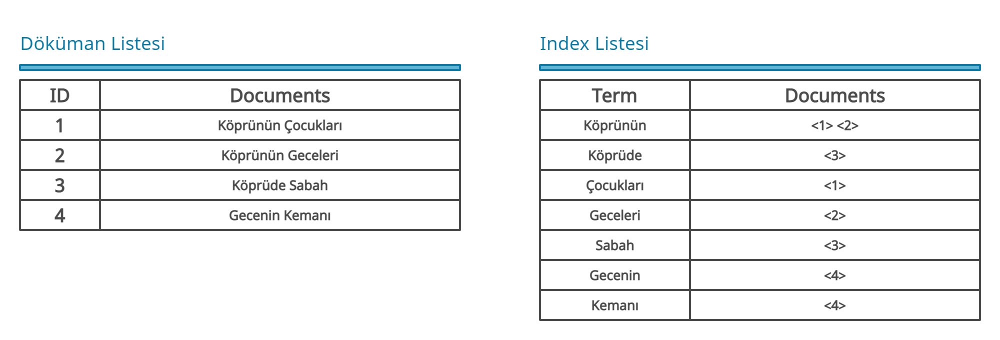

# nedir

## Elasticsearch Nedir?

Elasticsearch, Apache Lucene tabanlı bir tam metin arama ve analiz motorudur. Elasticsearch, birden çok kaynaktan gelen veriler üzerinde analiz işlemlerini gerçekleştirmeyi ve depolanan veriler üzerinde Fuzzy Search (bulanık arama) gibi yapılandırılmamış sorgular çalıştırmayı kolaylaştırır.

**Fuzzy Search:** Bir veri içerisinde arayacağımız metnin yakın eşleşmesini (LIKE) hedefleyen arama türüdür.

### Elasticsearch Özellikleri ve Avantajları

* Elasticsearch, her türden veri için kullanılabilir.
* Elasticsearch, verileri JSON formatında serileştirir. Bu yüzden NoSQL veritabanı olarakta kullanılabilir.
* Dağıtık ve ölçeklenebilir yapıda çalışabilir. Yatay ölçekleme yapılarak elasticsearch örneğini çalıştıran bir makinenin kapasitesini artırmak yerine, ihtiyaç duyulduğunda cluster içerisinde elasticsearch örneği oluşturulabilir.
* Gerçek zamanlı olarak verileri analiz edebilir.
* RESTful API arabirimi mevcuttur. Bu hizmet sayesinde elasticsearch tüm programlama dillerine entegre edilebilir.
* RESTful API arabirimi üzerinden ilişkisel veritbanlarıyla çalışan sistemlere benzer CRUD işlemleri kolay bir gerçekleştirilebilir.

### Elasticsearch Çalışma Mantığı

Elasticsearch, inverse indexing (ters indeksleme) olarak bilinen bir kavram üzerinde çalışır. Bu kavram her bir kelimenin hangi dökümanda bulunduğunu indexler. Elasticsearch'e herhangi bir veri kaydı gerçekleştirdiğimizde verilerimiz içerisindeki kelimelerin konumlarını bu kavram sayesinde indexleyerek kayıt eder. Bu sayede tüm veriler üzerinde arama yapmak yerine önceden indexlediğimiz bu liste üzerinden arama işlemi gerçekleştirilerek sonuçlar hızlı bir şekilde elde edilir.

<figure><figcaption></figcaption></figure>

### Elasticsearch Temel Kavramları

* **Indice:** Yukarıda bahsettiğimiz index listesi dosyalarımıza verilen addır.
* **Type:** İlişkisel veritabanlarında bulunan tablo görevindedir. Verilerimizi mantıksal bölümlere ayırmaktadır.
* **Document:** Type yapılarımız içerisindeki satırları ifade etmektedir.
* **Mapping:** Index listemizde bulunan verilerin türlerini tanımlama işleminde kullanılır.
* **Field:** Veritabanlarından aşına olduğumuz column (sütun) görevini görmektedir.
* **Cluster:** Bir veya birden fazla düğümün toplamında oluşan yapıdır. Elasticsearch içerisinde birden fazla düğümde barındırılan verilerimizi tek bir index üzerinden arayabilme işlemini gerçekleştirmemizi sağlar.
