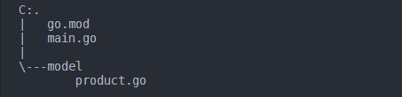

# struct

### Struct Nedir?

Struct, nesne yönelimli programlama dillerinde bulunan class (sınıf) yapısına benzemektedir. Fakat class'lar gibi kalıtım işlemi gerçekleştiremez. Kalıtım yerine composition işlemini gerçekleştirebilir.&#x20;

**Composition:** Kod tekrarını önlemek için büyük yapıların kendisinden daha küçük yapıların davranış ve özelliklerini kullanması olayıdır.&#x20;

### Struct Nasıl Kullanılır?

```go
package product

type Product struct {
	Id     int
	name   string
	slug   string
	skuNo string
}
```

Product yapımızın bir örneğini oluşturalım.&#x20;

```go
package main

import (
	"fmt"

	"github.com/bahri-hirfanoglu/go-struct/model"
)

func main() {
	product := model.Product{} //1. tanımlama şekli
	product2 := new(model.Product) //2. tanımlama şekli
	fmt.Printf("%+v\n", product)
	fmt.Printf("%+v\n", product2)
}
/*Output 
{Id:0 name: slug: skuNo:}
&{Id:0 name: slug: skuNo:}
```


<figure><figcaption></figcaption></figure>

### Struct'larda Kurucu Metot Var Mı?

Yukarıda { } parantezlerimizin arasına struct içerisinde bulunan özelliklerimizin başlangıç değerlerini atayabiliriz. Bu OOP'de sınıflarda bulunan constructor yani kurucu metot olarak düşünülebilir.

(Birebir kurucu metot ile aynı işlevi görmemektedir. OOP'de kurucu metotlarda almak istediğimiz parametreleri biz belirtebiliyoruz veya birden fazla kurucu metot oluşturabiliyoruz. Sadece kullanım benzerliği bulunmaktadır.)&#x20;

main fonksiyonumuzun içerisini aşağıdaki gibi güncellediğimizde **Id** özelliğimizin başlangıç değerini atamış oluruz.

```go
func main() {
	product := model.Product{Id: 1}
	fmt.Printf("%+v\n", product)
}
//Output {Id:1 name: slug: skuNo:}
```

### Struct'larda Erişim Denetleyicileri Var Mı?

Id dışındaki değişkenlere atama yapmama nedenimiz OOP'de aşına olduğumuz access modifiers yapısında bulunan private & public özelliklerinin go'da oluşturduğumuz fonksiyon, struct veya struct içerisinde bulunan özelliklerin ilk harflerine göre otomatik gerçekleşiyor olmasıdır. Yani eğer bir paket içerisine oluşturduğumuz herhangi bir yapıya farklı bir paket içerisinden erişilmesini istiyorsak baş harfini büyük yapmamız yeterli olacaktır. Eğer erişim olmasını istemiyorsak baş harfi küçük olmalıdır. Yaptığımız örnekte Product yapımız içerisinde sadece Id özelliğimizin baş harfini büyük yaptığımız için main paketimiz içerisinden sadece Id erişim sağlayabiliyoruz.&#x20;

### Struct **Composition İşlemi**

Bir struct yapısı içerisinde farklı bir struct yapısı oluşturabiliriz veya var olan bir struct yapısını kullanabiliriz.&#x20;

```go
type Product struct {
	Id          int
	name        string
	slug        string
	skuNo       string
	Description ProductDescription
	Media struct {
		url string
		format string
	}
}

type ProductDescription struct {
	title   string
	content string
}

```

**ProductDescription** adında bir yapı oluşturduk ve içerisine iki adet özellik tanımladık. Daha sonra bu yapımızı Product yapımız içerisinde **Description** özelliğinin tipi olarak belirttik. Bu şekilde composition işlemi uygulamış olduk. Ayrıca Media adında bir özellik tanımladık direkt Product yapımız içerisinde farklı bir struct yapısı daha oluşturmuş olduk.

### Struct'a Ait Fonksiyon Tanımlama

```go
func (p Product) Show() {
	fmt.Printf("Name: %s\n", p.name)
	fmt.Printf("Slug: %s\n", p.slug)
	fmt.Printf("SkuNo: %s\n", p.skuNo)
}
```

product.go dosyamız içerisine yukarıdaki fonksiyonu tanımlıyoruz. Bu fonksiyonu kısaca açıklama gerekirse func anahtar kelimemizden sonra yazılan (p Product) bölümü bu fonksiyonu sadece Product yapımızın örneklerinin kullanabileceğini yani fonksiyonun Product yapısına ait olduğunu belirtmektedir. Şimdi bu fonksiyonu çağıralım.&#x20;

```go
func main() {
	product := model.Product{Id: 1}
	product.Show()
}
/*
Output >
Name: 
Slug:  
SkuNo: 
*/
```

### Struct Getter Setter İşlemleri

Yukarıda erişim denetleme işleminden bahsederken ilk harfi küçük olan özelliklerimize farklı paket içerisinden erişemeyeceğimizi söylemiştik. Fakat getter ve setter fonksiyonları oluşturarak farklı paketler içinde erişim veya güncelleme işlemleri yapabiliriz.&#x20;

```go
func (p Product) GetName() string {
	return p.name
}

func (p *Product) SetName(name string) {
	p.name = name
}

```

Yukarıdaki kodları product.go içerisine yazıyoruz. Bu şekilde name özelliğimize farklı paketler içinden erişebilir veya değerini değiştirebiliriz.

```go
func main() {
	product := model.Product{Id: 1}
	product.SetName("Nokia 1280")
	fmt.Printf(product.GetName())
}
//Output: Nokia 1280
```

### JSON to Struct

Öncelikle product.go dosyamızda bulunan struct yapılarımız içerisindeki tüm özelliklerin ilk harflerini büyük hale getiriyoruz. Bunun sebebi tüm verilerimizi json datamız üzerinden dolduracak olmamızdır.

```go
package model

type Product struct {
	Id          int                `json:"id"`
	Name        string             `json:"name"`
	Slug        string             `json:"slug"`
	SkuNo       string             `json:"skuNo"`
	Description ProductDescription `json:"description"`
	Media       struct {
		Url    string `json:"url"`
		Format string `json:"format"`
	} `json:"Media"`
}

type ProductDescription struct {
	Title   string `json:"title"`
	Content string `json:"content"`
}
```

Görüldüğü üzere her bir özelliğimizin yanında **\`json: "key"\`** ibaresi bulunmaktadır. Go'nun sunduğu bu yapı ile kolay bir şekilde json datamız içerisinde ki key'leri struct yapımızdaki özelliklerimiz ile eşleştirmiş oluyoruz. Şimdi json datamızı modelimize dönüştürelim.&#x20;

```go
func main() {
	json_data := `{
	"id": "1",
	"name": "Nokia 1280",
	"slug": "nokia-1280",
	"skuNo": "SKN-NOKIA1280-4443",
	"Description": {
	  "title": "Ürün Açıklaması",
	  "content": "Kompakt ve dayanıklı Nokia 1280, geniş bir yelpazedeki pratik özelliklerle organize olmanıza ve kontrolde kalmanıza olanak verirken, kolayca iletişim kurmanıza imkan verir."
	},
	"Media": {
	  "url": "https://cdn.nokai.com/nokia-1289-434934939.jpg",
	  "format": "w:200|h:200|o|p|t"
	}
	}`
	product := new(model.Product)
	json.Unmarshal([]byte(json_data), product)
	fmt.Printf("%+v\n", product)

}
/* Output: 
&{Id:0 Name:Nokia 1280 Slug:nokia-1280 SkuNo:SKN-NOKIA1280-4443 Description:{Title:Ürün Açıklaması Content:Kompakt ve dayanıklı Nokia 1280, geniş bir yelpazedeki pratik özelliklerle organize 
olmanıza ve kontrolde kalmanıza olanak verirken, kolayca iletişim kurmanıza imkan verir.} Media:{Url:https://cdn.nokai.com/nokia-1289-434934939.jpg Format:w:200|h:200|o|p|t}}
```

json.Unmarshal yapısı go ile birlikte gelen "encoding/json" paketine aittir.&#x20;

### Sonuç

Struct kullanımı kolay ve OOP kavramlarından bazılarını kısmen uygulayabildiğimiz ama go'nun doğası gereği OOP uygulamaya gerek olmadan iç içe yapılar oluşturarak programlama kalitemizi arttıran go'nun bel kemiklerinden birisidir.&#x20;


