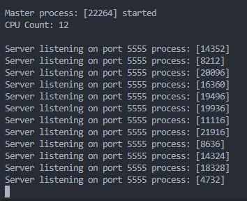
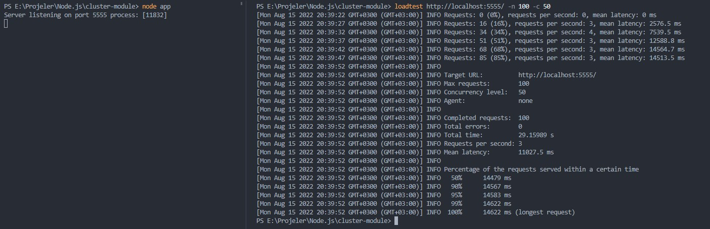
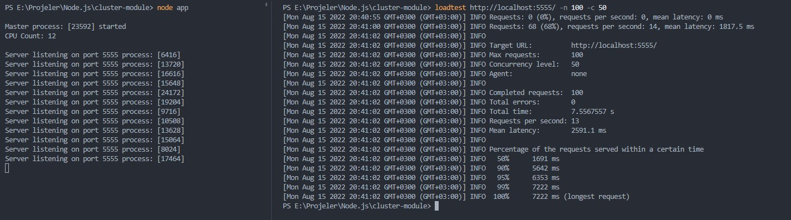

# cluster module

Bir Node.js projesi doğası gereği tek bir iş parçacığı üzerinde çalışmaktadır. Projemizin yükünü diğer tüm iş parçacıklarına dağıtmak için cluster modülünü kullanabiliriz.&#x20;

### Nedir?

Cluster modülü aynı anda çalışan ve ortak bir bağlantı noktasını kullanan alt işlemler oluşturmamıza olanak sağlar. Yani her iş parçacığımıza özel bir server ayağa kaldırır ve bu server ana process'e bağımlı olur.

### Avantajları

Cluster module kullanarak sunucumuzun cevap vereceği istek sınır sayısını arttırmış oluruz. Böylece bir iş parçacığında çalışan sunucumuz daha fazla istek alamayacak durumu geldiğinde yeni istekler diğer iş parçacıklarına dağıtılacaktır.&#x20;

Cluster modülünün avantajlarından birisi uygulamamızı güncellemek istediğimizde kesintiye uğramadan iş parçacıklarımızı sırayla yeniden başlatabilmemizdir. Bu şekilde sunucumuzun daima gelen isteklere cevap verecek aktif iş parçacıkları olacaktır.&#x20;

### Nasıl Çalışır?

Çalışma mantığını bir örnekle anlamaya çalışalım. Express ile **5555** portunu dinleyen bir http server ayağa kaldırdık.&#x20;

```javascript
const express = require("express"),
app = express(),
port = 5555;
 
app.get("/", (req, res) => {
  res.send(`path: ${req.path}`);
});

app.listen(port, () => {
  console.log(`Server listening on port ${port}`);
});
```

Şimdi bu yapımızı cluster modülü ile birleştirelim.

```javascript
const os = require("os"),
  cluster = require("cluster");

if (cluster.isMaster) {
  const cpuCount = os.cpus().length;
  
  console.log(`\nMaster process: [${process.pid}] started`);
  console.log(`CPU Count: ${cpuCount}\n`);
  
  for (let index = 0; index < cpuCount; index++) {
    cluster.fork();
  }
  
  cluster.on("exit", (worker, code, signal) => {
    console.log(`\nWorker ${worker.process.pid} exit\n`);
    cluster.fork();
  });
  
} else {
  const express = require("express"),
    fs = require('fs')
    app = express(),
    port = 5555;

  app.get("/", (req, res) => {
    let rawdata = fs.readFileSync('./data/drop.json');
    res.send(JSON.parse(rawdata));
  });

  app.listen(port, () => {
    console.log(`Server listening on port ${port} process: [${process.pid}]`);
  });
}

```

`cluster.isMaster` ile ana işlem olup olmadığı kontrolünü gerçekleştiriyoruz. Eğer ana işlem üzerindeysek çekirdek sayımız kadar `cluster.fork()` işlemi gerçekleştiriyoruz. Bu işlem her bir çekirdeğimiz için aynı bağlantı noktasını dinleyen bir express sunucusu ayağa kaldırıyor. Bu sunucuların hepsi master process bağlı olaran child processler olarak oluşturuluyor. Uygulamamızı çalıştırdığımızda console çıktısı aşağıdaki gibi olacaktır. \
_**NOT**_: **cluster.on** ile worker exit eventini dinleyebiliriz. Bu şekilde bir iş parçacığının sonlanma durumuna karşın boşta kalan iş parçacığı için yeni bir server ayağa kaldırabiliriz.



İş parçacıklarının performansa etkisini görebilmek adına drop.json içerisinde 1.2M satırlık bir veri dizisi oluşturduk. Önce tek çekirdekte çalışan express sunucumuzun için bir test yapalım. Test için **loadtest** paketini kullanacağız.

```bash
npm install -g loadtest
```

loadtest paketini global olarak kurduk. Şimdi aşağıdaki komutu çalıştırarak 50'si eş zamanlı olmak üzere toplamda 100 istek atacağız.&#x20;

```bash
loadtest http://localhost:5555/ -n 100 -c 50
```

Tek iş parçacığında çalışan sunucumuz için bu komutu çalıştırdığımızda çıktımız şu şekilde olacaktır.



Tek iş parçacığında çalışan sunucumuzun 100 isteğe cevap vermesi 29 saniye sürdü. Şimdi 12 ayrı iş parçacığında çalışan sunucumuz için test komutumuzu çalıştıralım.



Gördüğümüz üzere 29 saniyede tamamlanan işlemimiz bu sefer 7.5 saniyede tamamlandı.&#x20;

### Sonuç

Sonuç olarak cluster module ile var olan çekirdeklerimizin her birinde aynı bağlantı noktasını dinleyen child process'ler oluşturduk. Gelen bir istek kendinden bir önce gelen isteğin tamamlanmasını beklemeden boşta olan child process'e aktarılarak işleme alındı. Böylece sunucumuzun saniye başına cevap verebileceği istek sınırı artmış oldu.&#x20;

Tabii ki bu işlem her zaman mantıklı değildir. Yoğun cpu kullanımı olan bir uygulamamız yok ise cluster kullanmanın bir manası yoktur. Ayrıca sistemde var olan tüm çekirdekleri kullanıma sunmakta tavsiye edilen bir durum değildir. Biz olayın deneysel kısmını inceledik. Bir uygulama geliştirirken cluster yapısına ihtiyaç olup olmadığı için testler yapılmalı ve bunun sonucunda kullanılmalıdır.
