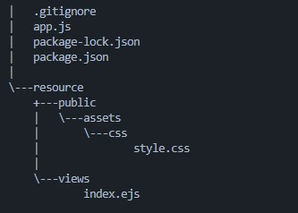

# executable

Javascript bir betik dili olduğu ve bir derleyicisi olmadığı için normal şartlarda yürütülebilir bir dosya halinde çalıştırılamaz. Fakat node.js runtime ve üçüncü parti paketler ile bu mümkün.&#x20;

Yürütülebilir bir dosya oluşturmak için öncelikle node.js ile basit bir uygulama oluşturalım.&#x20;




Yukarıdaki yapıda dosya ve klasörlerimizi oluşturduktan sonra express ve ejs paketlerini kuralım.

```shell
npm i express ejs
```

Kurulumlar tamamlandıktan sonra app.js dosyamızın içerisinde express ile bir http server ayağa kaldıralım.

```javascript
const express = require("express"),
path = require('path'),
ejs = require('ejs'),
app = express();

app.set('views', path.join(__dirname, '/resource/views'));
app.set("view engine", "ejs");
app.use(express.static("public"));

app.get('/', function(req, res) {
    res.render('index', {dirname: __dirname})
});

app.get('/assets/*', function(req, res) {
    res.sendFile(__dirname + "/resource/public/" + req.path)
});

const port = process.env.PORT || 3333;

app.listen(port, () => {
  console.log(`Server started! Listening port ${port}`);
});
```


Kodların tamamına repo'dan ulaşabilirsiniz.


Şimdi **nexe** paketini bilgisayarımıza aşağıdaki komutu kullanarak kuralım.

```bash
npm i nexe -g
```

Daha sonra build almak için aşağıdaki komutu çalıştıralım.

```shell
nexe app.js --build
```

Bu işlemden sonra uygulama dizinimize app.exe adında bir dosya oluşacaktır. exe dosyamızı çalıştırdığımızda http sunucumuzun ayağa kalktığını göreceğiz. Ayrıca exe dosyamızın boyutunun epey yüksek olması tüm npm paketlerini uygulamamız içerisine gömmesinden kaynaklıdır. Fakat bu şekilde derleme işlemi yaptığımızda app.exe dosyamızı farklı bir dizinde çalıştırdığımızda ejs dosyamızı bulamadığını göreceğiz. Bunun nedeni sadece app.js dosyamızı build almamızdan kaynaklıdır. Resource klasörümüzü build içerisine dahil etmek için aşağıdaki komutu çalıştırabiliriz.

```bash
nexe app.js -r resource/**/* --build
```

Bu şekilde resource klasörümüzü exe dosyamızın içerisine gömerek app.exe dosyamızı herhangi bir dizinde çalıştırabilir hale getirdik.&#x20;

### Önemli Notlar

**1)** app.js dosyamız içerisine dikkat edilmesi gereken önemli hususlardan birisi aşağıdaki kod satırını kullanarak view engin'nin ejs dosyalarımızı arayacağı dosya yolunu belirttik.

```javascript
app.set('views', path.join(__dirname, '/resource/views'));
```

**2)** ejs dosyamız içerisinde bulunan assets/css/style.css import işleminin 404'e düşmemesi için aşağıdaki kod satırını oluşturduk. Bu şekilde resource/public içerisinde bulunan style dosyalarımızı index içerisinde kullanabilir hale geldik.&#x20;

```javascript
app.get('/assets/*', function(req, res) {
    res.sendFile(__dirname + "/resource/public/" + req.path)
});
```

**3)** Eğer nexe ile build alırken herhangi bir hata ile karşılaşıyorsanız aşağıdaki kod satırını çalıştırarak build alırken karşılaşılan hataları detaylı şekilde görebilirsiniz.&#x20;

```
nexe app.js --build --verbose -t windows
```

**4)** Build alma işleminin başarılı bir şekilde gerçekleşmesi için [nasm ](https://www.nasm.us/)(**Netwide Assemble**) bilgisayarınızda kurulu olması gerekmektedir. Nasm kısaca [assembler](https://en.wikipedia.org/wiki/Assembly\_language#Assembler) ve [disassembler](https://en.wikipedia.org/wiki/Disassembler)'dır
