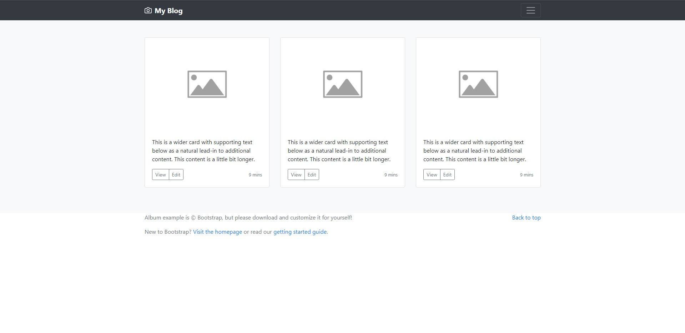
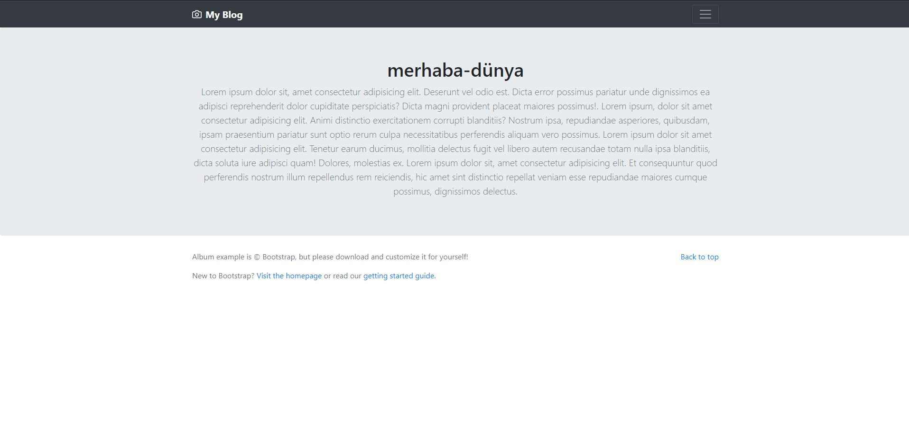
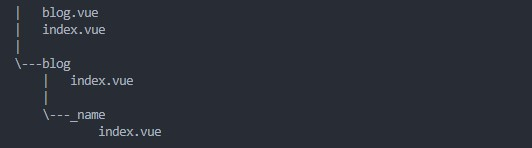

# nuxt-child

Nuxt.js'in bize sunduğu bir başka özellik olan **nuxt-child** iç içe route yapılarını kullanmamıza olanak sağlamaktadır.&#x20;

Örneğin bir blog sayfamızın olduğunu düşünelim ve bu blog sayfamızda **header** ve **footer** bölümleri sabit bu iki bölümün arasında kalan kısımlar değişkenlik göstermekte. Bu durumda normal şartlarda bir **header** birde **footer** componenti oluşturup tüm ilişkili sayfalarda bu componentleri çağırmamız gerekmektedir. Fakat nuxt-child yapısını kullanarak bu işlemi daha kolay ve işlevsel hale getirebiliriz.

Öncelikle bir nuxt projesi oluşturalım.&#x20;

```bash
yarn create nuxt-app <project-name>
```

Daha sonra pages klasörümüz içerisine blog adında bir klasör oluşturup index.vue componentini tanımlayalım. Bu component /blog isteklerini yakalayacaktır. Şimdi birde dinamik olarak /blog/blog-adi path'ine gelen istekleri yakalayacak yapımızı oluşturalım.&#x20;

**NOT:** _Nuxt.js routing hakkında bilgi sahibi değilsen_ [_bu yazıyı_](https://docs.bahrihrf.dev/nuxtjs/routing) _incelemeni öneririm._&#x20;

İstekleri yakalamak için blog klasörümüz içerisinde \_name adında bir klasör oluşturup içerisine index.vue componentimizi tanımlıyoruz. Bu şekilde genel yapımızı oluşturmuş olduk. Şimdi componentlerimizin içerisini basit şekilde tasarlayalım.&#x20;

blog/index.vue componentimiz içerisini bootstrap 4'ün örnek blog sayfalarından birini kopyalayarak oluşturalım.

```html
<template>
<div>
     <header>
      <div class="collapse bg-dark" id="navbarHeader">
        <div class="container">
          <div class="row">
            <div class="col-sm-8 col-md-7 py-4">
              <h4 class="text-white">About</h4>
              <p class="text-muted">Add some information about the album below, the author, or any other background context. Make it a few sentences long so folks can pick up some informative tidbits. Then, link them off to some social networking sites or contact information.</p>
            </div>
            <div class="col-sm-4 offset-md-1 py-4">
              <h4 class="text-white">Contact</h4>
              <ul class="list-unstyled">
                <li><a href="#" class="text-white">Follow on Twitter</a></li>
                <li><a href="#" class="text-white">Like on Facebook</a></li>
                <li><a href="#" class="text-white">Email me</a></li>
              </ul>
            </div>
          </div>
        </div>
      </div>
      <div class="navbar navbar-dark bg-dark box-shadow">
        <div class="container d-flex justify-content-between">
          <a href="#" class="navbar-brand d-flex align-items-center">
            <svg xmlns="http://www.w3.org/2000/svg" width="20" height="20" viewBox="0 0 24 24" fill="none" stroke="currentColor" stroke-width="2" stroke-linecap="round" stroke-linejoin="round" class="mr-2"><path d="M23 19a2 2 0 0 1-2 2H3a2 2 0 0 1-2-2V8a2 2 0 0 1 2-2h4l2-3h6l2 3h4a2 2 0 0 1 2 2z"></path><circle cx="12" cy="13" r="4"></circle></svg>
            <strong>My Blog</strong>
          </a>
          <button class="navbar-toggler" type="button" data-toggle="collapse" data-target="#navbarHeader" aria-controls="navbarHeader" aria-expanded="false" aria-label="Toggle navigation">
            <span class="navbar-toggler-icon"></span>
          </button>
        </div>
      </div>
    </header>
    
      <main role="main">
      <div class="album py-5 bg-light">
        <div class="container">
          <div class="row">
            <div class="col-md-4">
              <div class="card mb-4 box-shadow">
                
                <div class="card-body">
                  <p class="card-text">This is a wider card with supporting text below as a natural lead-in to additional content. This content is a little bit longer.</p>
                  <div class="d-flex justify-content-between align-items-center">
                    <div class="btn-group">
                      <button type="button" class="btn btn-sm btn-outline-secondary">View</button>
                      <button type="button" class="btn btn-sm btn-outline-secondary">Edit</button>
                    </div>
                    <small class="text-muted">9 mins</small>
                  </div>
                </div>
              </div>
            </div>
            <div class="col-md-4">
              <div class="card mb-4 box-shadow">
                
                <div class="card-body">
                  <p class="card-text">This is a wider card with supporting text below as a natural lead-in to additional content. This content is a little bit longer.</p>
                  <div class="d-flex justify-content-between align-items-center">
                    <div class="btn-group">
                      <button type="button" class="btn btn-sm btn-outline-secondary">View</button>
                      <button type="button" class="btn btn-sm btn-outline-secondary">Edit</button>
                    </div>
                    <small class="text-muted">9 mins</small>
                  </div>
                </div>
              </div>
            </div>
            <div class="col-md-4">
              <div class="card mb-4 box-shadow">
                
                <div class="card-body">
                  <p class="card-text">This is a wider card with supporting text below as a natural lead-in to additional content. This content is a little bit longer.</p>
                  <div class="d-flex justify-content-between align-items-center">
                    <div class="btn-group">
                      <button type="button" class="btn btn-sm btn-outline-secondary">View</button>
                      <button type="button" class="btn btn-sm btn-outline-secondary">Edit</button>
                    </div>
                    <small class="text-muted">9 mins</small>
                  </div>
                </div>
              </div>
            </div>
          </div>
        </div>
      </div>
    </main>
    
    <footer class="text-muted">
      <div class="container">
        <p class="float-right">
          <a href="#">Back to top</a>
        </p>
        <p>Album example is &copy; Bootstrap, but please download and customize it for yourself!</p>
        <p>New to Bootstrap? <a href="../../">Visit the homepage</a> or read our <a href="../../getting-started/">getting started guide</a>.</p>
      </div>
    </footer>
</div>

</template>

<script>
export default {

}
</script>

<style>

</style>
```



Daha sonra \_name klasörümüz içerisinde ki index.vue componentinin yapısını oluşturalım.&#x20;

```html
<template>
<div>
      <header>
      <div class="collapse bg-dark" id="navbarHeader">
        <div class="container">
          <div class="row">
            <div class="col-sm-8 col-md-7 py-4">
              <h4 class="text-white">About</h4>
              <p class="text-muted">Add some information about the album below, the author, or any other background context. Make it a few sentences long so folks can pick up some informative tidbits. Then, link them off to some social networking sites or contact information.</p>
            </div>
            <div class="col-sm-4 offset-md-1 py-4">
              <h4 class="text-white">Contact</h4>
              <ul class="list-unstyled">
                <li><a href="#" class="text-white">Follow on Twitter</a></li>
                <li><a href="#" class="text-white">Like on Facebook</a></li>
                <li><a href="#" class="text-white">Email me</a></li>
              </ul>
            </div>
          </div>
        </div>
      </div>
      <div class="navbar navbar-dark bg-dark box-shadow">
        <div class="container d-flex justify-content-between">
          <a href="#" class="navbar-brand d-flex align-items-center">
            <svg xmlns="http://www.w3.org/2000/svg" width="20" height="20" viewBox="0 0 24 24" fill="none" stroke="currentColor" stroke-width="2" stroke-linecap="round" stroke-linejoin="round" class="mr-2"><path d="M23 19a2 2 0 0 1-2 2H3a2 2 0 0 1-2-2V8a2 2 0 0 1 2-2h4l2-3h6l2 3h4a2 2 0 0 1 2 2z"></path><circle cx="12" cy="13" r="4"></circle></svg>
            <strong>Album</strong>
          </a>
          <button class="navbar-toggler" type="button" data-toggle="collapse" data-target="#navbarHeader" aria-controls="navbarHeader" aria-expanded="false" aria-label="Toggle navigation">
            <span class="navbar-toggler-icon"></span>
          </button>
        </div>
      </div>
    </header>

      <section class="jumbotron text-center">
        <div class="container">
          <h1 class="jumbotron-heading">{{$route.params.name}}</h1>
          <p class="lead text-muted">Lorem ipsum dolor sit, amet consectetur adipisicing elit. Deserunt vel odio est. Dicta error possimus pariatur unde dignissimos ea adipisci reprehenderit dolor cupiditate perspiciatis? Dicta magni provident placeat maiores possimus!. Lorem ipsum, dolor sit amet consectetur adipisicing elit. Animi distinctio exercitationem corrupti blanditiis? Nostrum ipsa, repudiandae asperiores, quibusdam, ipsam praesentium pariatur sunt optio rerum culpa necessitatibus perferendis aliquam vero possimus. Lorem ipsum dolor sit amet consectetur adipisicing elit. Tenetur earum ducimus, mollitia delectus fugit vel libero autem recusandae totam nulla ipsa blanditiis, dicta soluta iure adipisci quam! Dolores, molestias ex. Lorem ipsum dolor sit, amet consectetur adipisicing elit. Et consequuntur quod perferendis nostrum illum repellendus rem reiciendis, hic amet sint distinctio repellat veniam esse repudiandae maiores cumque possimus, dignissimos delectus.</p>
          <p>
          </p>
        </div>
      </section>

      <footer class="text-muted">
      <div class="container">
        <p class="float-right">
          <a href="#">Back to top</a>
        </p>
        <p>Album example is &copy; Bootstrap, but please download and customize it for yourself!</p>
        <p>New to Bootstrap? <a href="../../">Visit the homepage</a> or read our <a href="../../getting-started/">getting started guide</a>.</p>
      </div>
    </footer>
</div>

</template>

<script>
export default {

}
</script>

<style>

</style>
```



Componentlerimizin içerisini incelediğimizde her iki sayfada ortak olan ve yerleri sabit olan 2 adet yapımız var. Bunlar header ve footer yapıları. Bu yapıları yazının başında dediğim gibi component haline getirerek ihtiyacımız olan yerlerde kullanabiliriz. Fakat zaten bu footer ve header yapıları bize tüm blog ve bloğun alt sayfalarında gerek olacağı için nuxt-child yapısını kullanarak bu durumu çözebiliriz.&#x20;

Şimdi pages klasörümüz içerisinde <mark style="background-color:green;">**blog.vue**</mark> adında bir component oluşturalım.



Daha sonra diğer blog sayfalarımızda ortak olan header ve footer yapılarını diğer sayfalarımızdan kaldırarak <mark style="background-color:green;">**blog.vue**</mark> componenti içerisine aktaralım. Daha sonra header ve footer tagları arasına <mark style="background-color:yellow;">**\<nuxt-child />**</mark>** ** componentini çağıralım. Bu yapı ile blog ve bloğun tüm alt route'larına gelen istekler header ve footer yapılarımız arasında bulunan nuxt-child componenti ile render edilecektir. Artık /blog veya /blog/blog-adimiz sayfalarında gezindiğimizde header ve footer componentlerimizin otomatik olarak geleceğini göreceğiz.&#x20;

**NOT:** Oluşturduğumuz blog.vue dosyasının adı farklı olsaydı nuxt.js bize hata verecekti. nuxt-child ilişkisinin kurulması için ana route ve oluşuturulan component adı aynı olmak zorundadır.&#x20;
