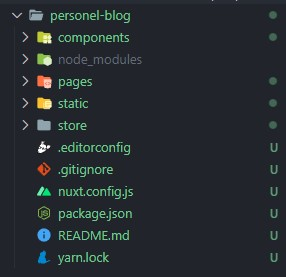

# routing

Nuxt.js vue'nin routing sisteminden farklı olarak bizlere klasör yapısı ile route işlemleri yapmamıza olanak sağlıyor. Bir uygulama çerçevesinden routing işlemini inceleyelim.&#x20;

nuxt uygulaması oluşturmak için terminalimizi açıp aşağıdaki komutu çalıştırıyoruz.&#x20;

```shell
yarn create nuxt-app <project-name>
```

Kurulum işlemi sırasında çeşitli sorular ile karşılaşabiliriz bu kısımları kendinize uygun olarak doldurup kurulumu tamamlayabilirsiniz. Kurulum sonrası proje yapımız aşağıdaki gibi olacaktır.



Nuxt.js'in bize sunduğu routing yapısını pages içerisinde kullanabiliriz. Projemizi ayağa kaldırmak için <mark style="color:orange;">**`yarn dev`**</mark> veya <mark style="color:orange;">**`npm run dev`**</mark> komutunu kullanabiliriz. (Kurulum esnasında hangisini seçtiyseniz onunla devam etmelisiniz.) Sunucumuz localhost:3000 portunda ayağa kalmış durumda.&#x20;

### Component adı ile route işlemi

Routing işlemine başlayalım. Pages klasörü içerisini açtığımızda <mark style="background-color:green;">**index.vue**</mark>** ** adında bir componentin olduğunu göreceğiz. Bu component http://localhost:3000/ adresine giriş yaptığımızda render olan sayfamızdır. Nuxt.js pages klasörü içerisinde bu dosyayı arar ve eğer varsa routing işlemini otomatik olarak gerçekleştirir.&#x20;

Aynı şekilde farklı bir isimde component oluşturursak otomatik olarak route işlemi gerçekleşecektir. Yani pages klasörü içerisinde <mark style="background-color:green;">**about.vue**</mark> componentini oluşturup http://localhost/about adresine giriş yaptığımızda <mark style="background-color:green;">**about.vue**</mark> componenti render olacaktır. &#x20;

### Klasör adı ile route işlemi

Tabii ki tüm componentleri bu şekilde pages klasörü içerisine yazmak proje ilerledikçe içinden çıkılmaz bir hal alacaktır. Bu yüzden klasörler ile de route işlemi yapabiliyoruz. pages dizinimiz içerisine <mark style="color:yellow;">**contact**</mark> adında bir klasör oluşturup onun içerisine <mark style="background-color:green;">**index.vue**</mark> componentini oluşturarak http://localhost/contact route'nu karşılayabiliriz. Bu klasörleme işlemini dallandırabiliriz. Örneğin contact klasörü içerisine direkt <mark style="background-color:green;">**detail.vue**</mark> veya <mark style="color:yellow;">**detail**</mark> klasörü oluşturup içerisine <mark style="background-color:green;">**index.vue**</mark> componenti oluşturarak http://localhost/contact/detail adresine gelen istekleri karşılayabiliriz.&#x20;

### Route üzerinden parametre alma

Vue ile route işleminde parametre almak için route oluştururken : ile alacağımız parametrenin adını belirtmemiz gerekiyordu. Nuxt.js bu durumu da pages klasörü içerisinde halletmemizi sağlıyor. Öncelikle blog adında bir klasör oluşturup içerine index.vue componentini tanımlayalım.&#x20;

```html
<template>
  <div>BLOG LİSTESİ</div>
</template>

<script>
export default {};
</script>

<style></style>
```

Bu component http://localhost:3000/blog adresine girdiğimizde render olacaktır. Şimdi blog/blog-adi şeklinde dinamik olan blog detay sayfamızı oluşturalım. Bunun için yapmamız gereken blog klasörümüz içerisinde \_name adında bir klasör oluşturup içerisine <mark style="background-color:green;">**index.vue**</mark> tanımlamak. Bu işlemden sonra <mark style="color:blue;">**blog/ilber-ortaylı**</mark> şeklinde göndereceğimiz tüm istekler bu componente düşecektir. Peki /'den sonraki name parametresini nasıl alacağız? Daha önceden vue kullananların bileceği üzere _**$route.params.name**_ şeklinde değerimizi alabiliriz.&#x20;

Peki bu değeri validate etmek istersek? Nuxt.js bu durumu düşünerek componentimiz içerisinde bulunan script taglarımız arasına tanımlayabileceğimiz nuxt.js'e özel <mark style="color:purple;">**validate()**</mark> fonksiyonunu bizlere sunmuş. Bu fonksiyonu kullanarak gelen parametremizi validate işlemlerinden geçirip eğer beklediğimiz bir veri değilse return <mark style="color:red;">false</mark> yaparak sayfanın yüklenmesini engelleyebiliriz veya return <mark style="color:green;">true</mark> sayfamızı başarılı bir şekilde render edebiliriz.&#x20;

Aşağıda \_name klasörümüz içerisinde bulunan index.vue componenti içerisinde uyguladığım bir validate işlemi mevcut. Bu işlem name parametremin numeric bir değer olup olmadığını kontrol ediyor eğer numeric değilse true numeric ise false döndürerek validate işlemini sonlandırıyor.&#x20;

```html
<template>
  <div>
    <h1>BLOG BAŞLIĞI: {{ $route.params.name }}</h1>
  </div>
</template>

<script>
export default {
  validate({ params }) {
    let name = params.name
    return !/^-?\d+$/.test(name);
  },
};
</script>

<style></style>

```

false dönmesi durumunda default nuxt.js <mark style="color:red;">**404**</mark> sayfası render oluyor. Bu sayfayı özelleştirmek için layouts klasörü içerisine <mark style="background-color:green;">**error.vue**</mark> componentini oluştabilirsiniz. Bundan sonra hata durumlarında bu sayfa render olacaktır.&#x20;

**NOT:** Eğer layouts klasörü projenizde yok ise proje ana dizinine oluşturmanız yeterli olacaktır.\
**NOT:** Tüm route işlemleri nuxt.js özel olmakla beraber vue'nun kendi routing yapısı da kullanılabilir. Nuxt.js routing sistemi basit veya orta düzey projelerde kolaylıklar sağlamaktadır. Büyük ölçekli projelerde tercih edilmeyebilir.&#x20;
