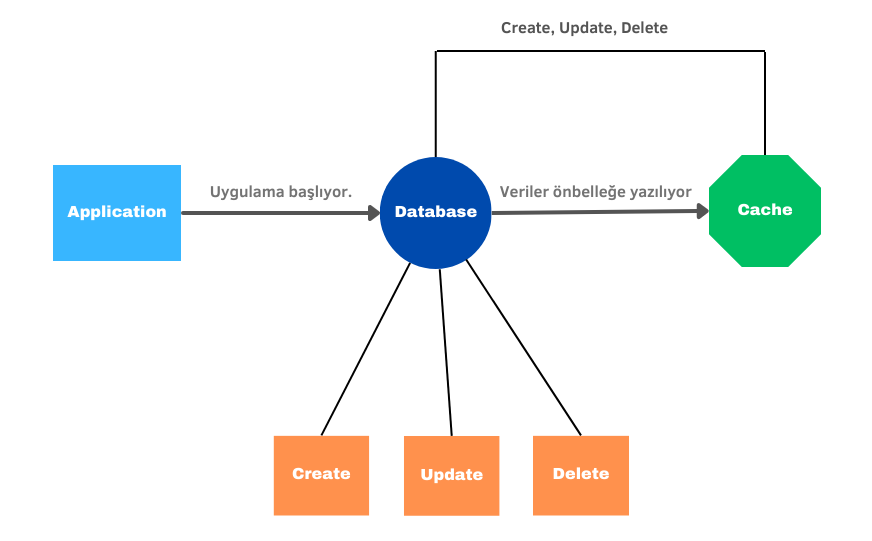

# cache strategies

### Scheduled Preloaded Cache

_**Planlanmış ve Önceden Yüklenmiş Cache Yönetemi**_

Bu cache stratejisinde hizmetimiz ayağa kalkarken db’mizde bulunan tüm veriler cachlenir ve gelen istekler db gitmek yerine direkt cacheden okunarak alınır. X zamanda bir db’mizde bulunan veriler cache yazılarak cache güncel tutulur. (Tabii ki X zaman kadar verilerimiz doğru olmayabilir %100 kararlı bir veri olmayacaktır.)

<figure><figcaption></figcaption></figure>

### Read Through Cache

_**Ön Bellekten Okuma Yöntemi**_

Bu cache stratejisinde gelen istek cache'de mevcut mu diye kontrol edilir eğer değilse veri db’den çekilir ve cache sistemine kaydedilir. Bu şekilde gelecek bir sonraki işlem direkt olarak cacheden yüklenecektir.

<figure><figcaption></figcaption></figure>

### Write Through Cache

_**Önbelleğe Yazma Yöntemi**_

Bu cache stratejisinde ise db’de yapılan create, delete, update gibi işlemlerden sonra veri anında cache yazılır veya cachede varsa güncellenir. Bu şekilde db ile cache daima senkron olacaktır. Tabii ki bu yapılacak olan create, update, delete gibi işlemlerin süresini uzatacaktır ve belli bir kaynağa maal olacaktır.

<figure><figcaption></figcaption></figure>

### Preloaded Write Through Cache

_**Önceden Yüklenmiş Önbelleğe Yazma Yöntemi**_

Bu işlemde tüm veriler yine hizmetimiz ayağa kalkarken cache yazılır daha sonra cache yazılan bu veriler dinamik olması için her create, update ve delete eşlemlerinden sonra cachede bulunan  veriler güncellenir. Bu şekilde verilerin kararlılık oranı çok yüksek olacaktır.

<figure><figcaption></figcaption></figure>

### Distributed Cache vs Local Cache

Local cache genelde uygulamamız çalışırken ram belleğe alınan cachelerdir. Bu cacheler uygulamamız restart olduğunda veya yeni bir sürümü deploy almak istediğimizde otomatik olarak boşalacağından dolayı tekrar tüm verilerimizin cachelenmesi gerekecektir.

Dağıtılmış cache sisteminde cachelenen veriler farklı bir makinada veya hizmette depolanacağından dolayı uygulamamızın yeniden başlatılması vb durumlarda cache datamız sıfırlanmayacak ve kullanılabilir durumda olacaktır. Tabii bu yöntem için daha fazla kaynak gerekmektedir.

**Kaynak**: [https://medium.com/outbrain-engineering/caching-strategies-in-high-throughput-systems-733189e62a4d](https://medium.com/outbrain-engineering/caching-strategies-in-high-throughput-systems-733189e62a4d)
