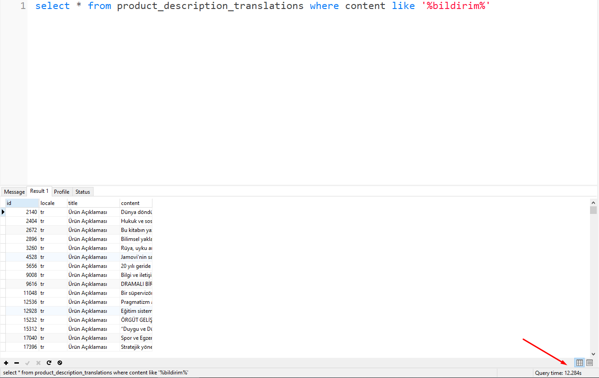
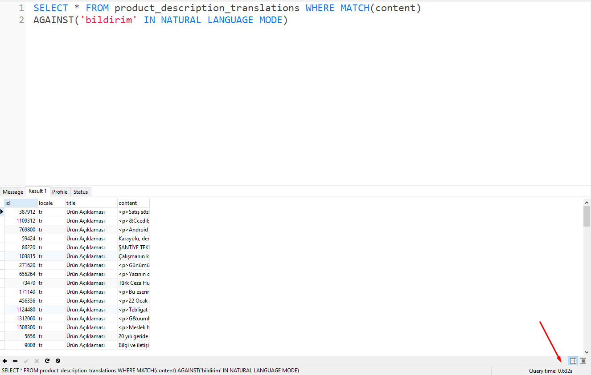

# mysql full text search

Mysql ile bir arama işlemi gerçekleştirmek istediğimizde _**Where**_ anahtar kelimesini kullanırız. Aşağıda products tablosunda id alanı 3'e eşit olan kaydı getiren bir sorgu var. Genelde böyle bir arama işlemi gerçekleştirdiğimizde sonuca hızlı bir şekilde ulaşırız.&#x20;

```sql
select * from product_translations where id = 3
```

Peki sözel bir ifadenin içinde arama yapmak istersek. O zaman **LIKE** anahtar sözcüğünü kullanmamız gerekir. Aşağıdaki sorgu products tablosunun name kolonu içerisinde "**matlab**" kelimesini içeren kayıtları getirir.&#x20;

```sql
select * from product_translations where name like '%matlab%'
```

Peki bu şekilde arama yapmak performanslı mıdır? Az sayıda veride bu şekilde arama yapmanın gözle görülür bir performans düşüklüğü yoktur. Fakat çok fazla veride bu şekilde arama işlemi gerçekleştirmek uzun saniyeler sürebilir. Canlı bir örnekle bu durumu yakından inceleyelim.&#x20;

_**NOT:** Örnek için kullanılan tablo içerisinde toplamda 410.000 kayıt bulunmaktadır._&#x20;

Aşağıdaki görselde **product\_description\_translations** tablosunda **content** alanında "_bildirim_" dizesini içeren kayıtları getirmesini istedik.&#x20;

<figure><figcaption></figcaption></figure>

Görüldüğü üzere bu işlemin tamamlanması **12.2** saniye sürdü. Bu çok uzun bir süre ve veritabanı trafiğine göre dahada artış gösterebilir. Şimdi full text search ile aynı işlemi gerçekleştirelim.&#x20;

Aşağıda görüldüğü üzere **AGAINST** anahtar kelimesi ile full text search işlemi gerçekleştirdik ve aynı işlemi **0.6** saniyede tamamladık.&#x20;

<figure><figcaption></figcaption></figure>

**NOT:** Full text search işlemini gerçekleştirmek için tablomuz oluşturulurken full text aramasına dahil olacak kolonları belirtmemiz gerekir veya tablomuz oluştuktan sonra kolonları full text aramaları için kullanılabilir hale getirebiliriz

```sql
CREATE TABLE products (
id INT UNSIGNED AUTO_INCREMENT NOT NULL PRIMARY KEY, 
name VARCHAR(200), 
description TEXT, 
FULLTEXT(name,description)
) ENGINE=InnoDB;

//OR
ALTER TABLE  table_name  
ADD FULLTEXT(column_name1, column_name2,…)
```

**NOT:** Arama yaparken kullanabileceğimiz tüm modların listesi aşağıda bulunmaktadır. Bu modların detaylı bilgisine [https://dev.mysql.com/doc/refman/8.0/en/fulltext-search.html](https://dev.mysql.com/doc/refman/8.0/en/fulltext-search.html) adresinden ulaşabilirsiniz.&#x20;

```sql
search_modifier:
  {
       IN NATURAL LANGUAGE MODE
     | IN NATURAL LANGUAGE MODE WITH QUERY EXPANSION
     | IN BOOLEAN MODE
     | WITH QUERY EXPANSION
  }
```

Şimdi gelelim bu işlemin normal search ile arasındaki farklara ve neden sonuca bu kadar hızlı ulaşabildiğimize.&#x20;

**LIKE** ile search ettiğimizde sırayla tüm satılarda bulunan content kolonu  içerisinde '_bildirim_' dizesinin geçip geçmediği kontrol edilir. Yani burada yapılan arama işlemi yatay arama işlemi olarak adlandırılır. content içeriğini ayrıştırmak ve daha sonra aramak ve bunun her satır için tekrar etmek işlemin uzun sürmesine neden olmaktadır. Tüm arama algoritmalarında dikey arama yatay aramaya göre çok daha hızlıdır. Bu yüzden _**where id = 3**_ gibi bir arama yaptığımızda sonuca çok hızlı ulaşırız. Çünkü arama işlemi yukarıdan aşağıya dikey olarak gerçekleşir.&#x20;

Full Text Search işleminde de content içerisinde bulunan tüm veriler arka planda kelimelerine ayrılıp alt alta tutulduğu için aramayı yatayda yapmak yerine dikeyde gerçekleştiriyoruz. Böylece yatay aramanın hantallığından kurtularak dikey arama ile çok daha hızlı şekilde sonucumuzu elde ediyoruz.&#x20;
