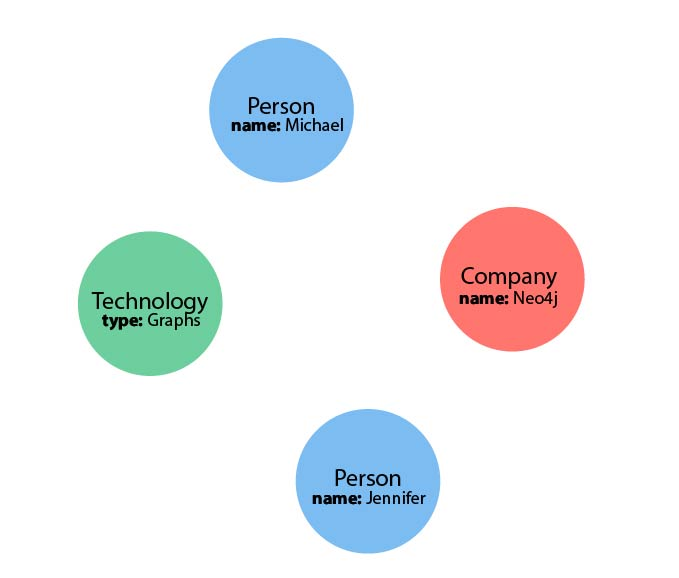

# neo4j

Büyük ve ilişkisel verileri depolama ve işleme özelliğine sahip kullanımı zor olmayan grafik tabanlı bir veritabanıdır. SQL’e benzer cypher adında sorgu dili vardır.

### Neo4j Yapısı

* **Nodes**

Neo4j’de her kayıt bir Nodes’dur. Her node’un içerisinde properties olabilir. Örnek `id: 3, name: ahmet` gibi properties'ler bulunabilir.

Node oluşturma için aşağıdaki sorguyu kullanabiliriz.

```cypher
Create (n:Person {id:1, companies: [1,2,3], name: 'Cevdet'})
```

* **Lables**

Lables oluşturduğumuz nodlara verdiğimiz isimdir. Örnek aşağıdaki sorgu ile oluşturduğumuz bir node Label'ı **Person’dur**

```cypher
Create (n:Person)
```

* **Relationships**

Neo4j’in en önemli özelliği ilişkisel veriler oluşturması ve bu ilişkilerin sayıları fazla olsa bile çok yüksek performans vermesidir. Aşağıdaki sorguda bir personelin birden çok firma ile ilişkisinin olabileceği varsayılarak **PersonCompany** nodes oluşturulmuştur.&#x20;

```cypher
Match (a:Person), (b:Company)
where (b.id IN a.companies)
create (a) - [r:PersonCompany {name:a.name+'<->'+b.name}] -> (b)
return type(r), a,b
```

Yukarıda bulunan **Match** aslında SQL’deki select yada **INNER JOIN** olarak düşünülebilir. Yukarıdaki sorguyu açıklayacak olursak. Label'ları çağırdık ve ilişkiyi kuracağımız properties'leri belirterek kesişimlerinden yeni bir **nodes** oluşturduk.

<figure><figcaption></figcaption></figure>

### Bazı Cypher Sorguları

Person lables içerisinde bulunan nodes’lardan birini döner.

```cypher
MATCH (p:Person)
RETURN p
LIMIT 1
```

Person lables içerisinde bulunan nodes’lardan ismi Cevdet olan kayıtları döner.

```cypher
MATCH (tom:Person {name: 'Cevdet'})
RETURN tom
```

Person lables içerisinde bulunan bir nodes'in ilişkili olduğu varklı bir lables içerisindeki kaydını döner.

```cypher
MATCH (:Person {name: 'Tom Hanks'})-[:DIRECTED]->(movie:Movie)
RETURN movie

//Belli bir properties döner
MATCH (:Person {name: 'Tom Hanks'})-[:DIRECTED]->(movie:Movie)
RETURN movie.title

//Birden çok node içerisinde bulunan verileri döner
MATCH (person:Person {name: 'Tom Hanks'})-[:DIRECTED]->(movie:Movie)
RETURN movie.title, person.name
```
